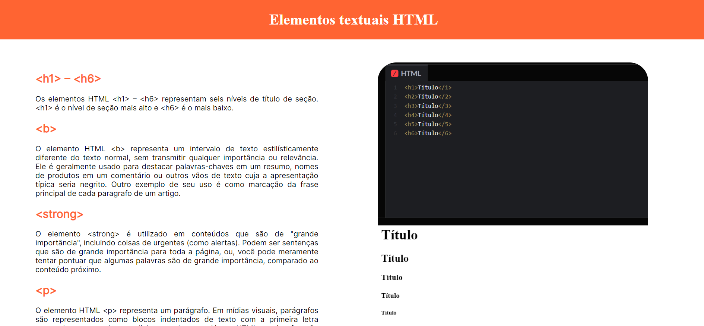
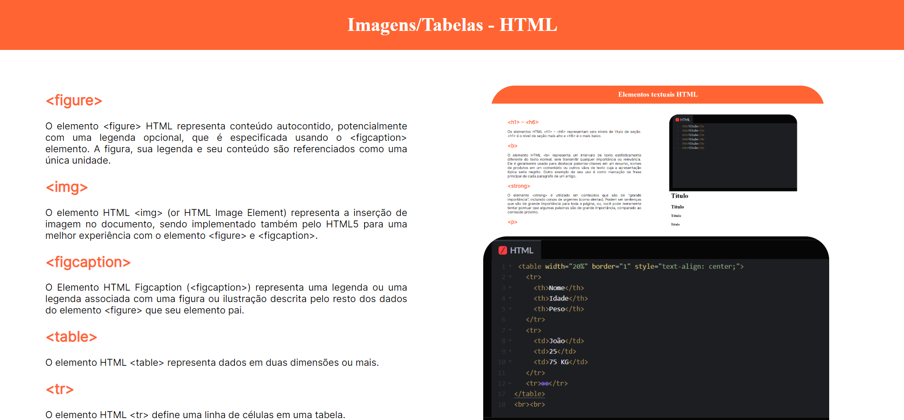
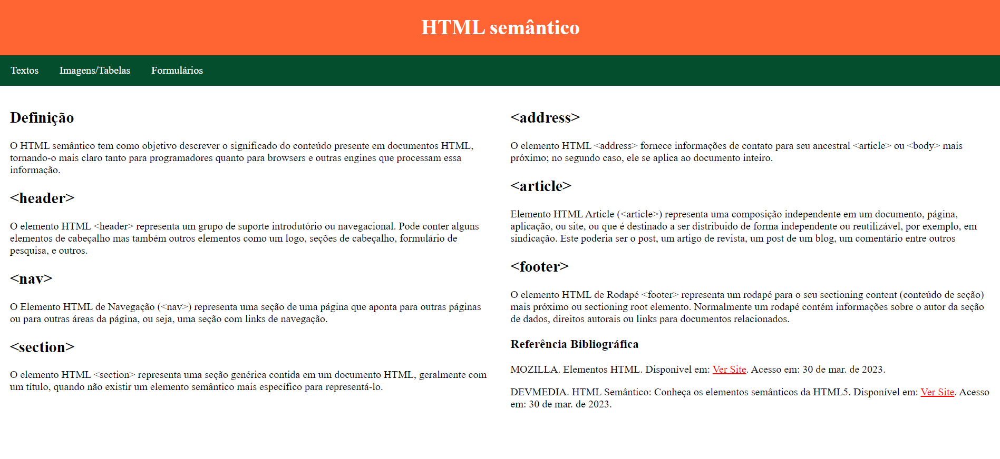
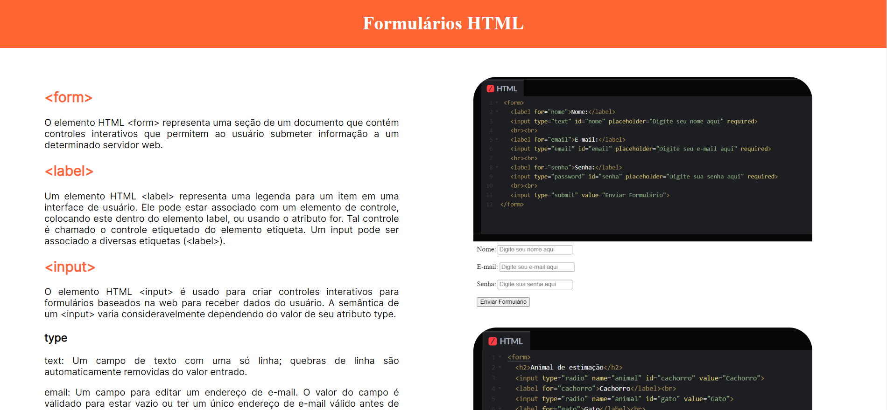
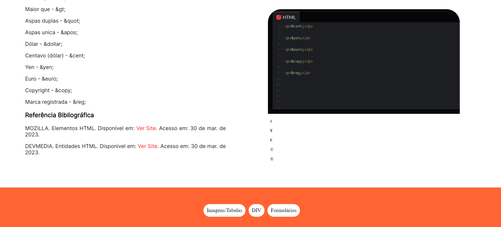

<h1 align="center">Elementos HTML</h1>

Página web com conceitos importantes de HTML.

  <a href="#-tecnologias">Tecnologias</a>     |    
  <a href="#-projeto">Projeto</a>     |    
  <a href="#-licença">Licença</a>

  

 

  
  
  
  
  

## 🚀 Tecnologias

Esse projeto foi desenvolvido com as seguintes tecnologias:

- HTML
- CSS
- Git
- Github
- Visual Studio Code

## 💻 Projeto

Página web com conceitos básicos de JavaScript.

- [ Visite o projeto online ](https://lipeharakawa.github.io/JS-intermediario)

## ✅ Licença

Esse projeto está sob a licença MIT.

---

Feito com ❤️ por Felipe Seidi Harakawa.